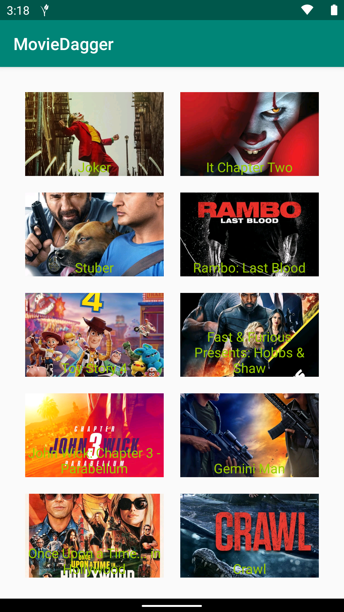

# Kotlin base MVVM (Model-View-ViewModel)

Project is build on kotlin by following MVVM architecture with the help of RxJava, Dagger 2, TMDB database and Retrofit

The Project architecture contains following folders

### data
The folder contains data management and api call

### di
The folder contains dependency injection components

### ui
The folder contains ui of the app(Activity, fragment, model)

# ScreenShot

 

